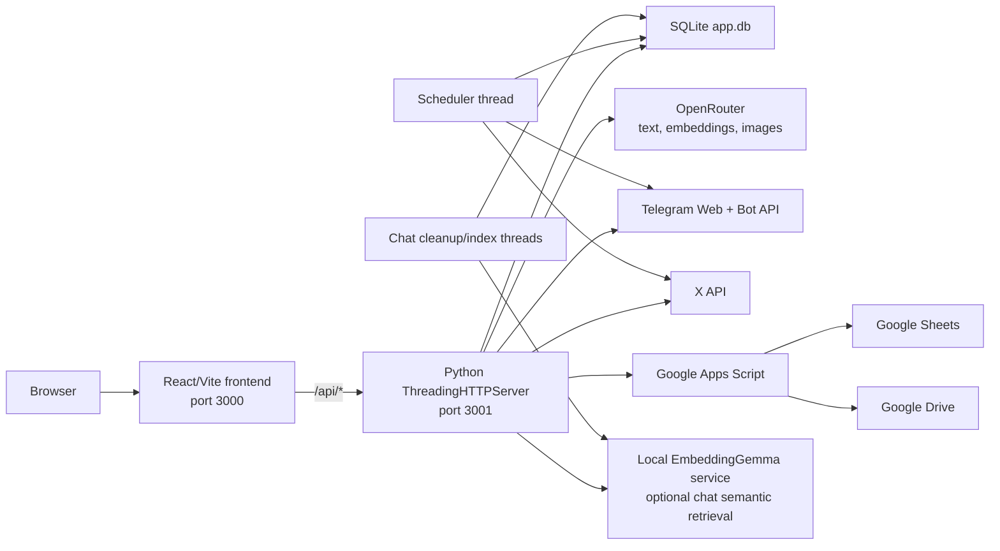

# ChainReporter Current Architecture and Feature Reference

> Status: Approved architecture reference
> Snapshot date: 2026-08-12
> Scope: The system as it exists today. This is not a migration plan or a future-state proposal.

## 1. Purpose

This document gives developers a single source of truth for the current ChainReporter application. It explains:

- what the product does;
- how the frontend, backend, database, background processes, and external services fit together;
- which files own each feature;
- every current HTTP endpoint and its authentication behavior;
- the main data and request flows;
- the runtime and deployment topology;
- implementation details that are easy to miss when reading individual files.

The source code remains authoritative when it changes after the snapshot date. Update this document in the same pull request whenever architecture, endpoints, persistent data, or feature ownership changes.

## 2. System summary

ChainReporter is an authenticated editorial workspace for four media brands:

- RZ Prime
- Coin Hall
- ChainReporter
- Meta Coin Guard

It gathers cryptocurrency and Web3 stories from RSS feeds and public Telegram channels, filters and routes them to media brands, asks multiple AI models to make editorial selections, generates platform-specific social copy and images, and lets users approve, save, schedule, or publish the resulting content.

The application also contains:

- an account dashboard with activity, saved cards, schedules, and keyword history;
- a bilingual English/Persian interface;
- a local, scoped RAG assistant for product and brand questions;
- Google Sheets and Google Drive synchronization;
- direct Telegram and X publishing.

## 3. Runtime architecture



### 3.1 Frontend process

- React 19 and Vite build the single-page application in `frontend/`.
- React Router handles `/login`, `/multimedia`, `/about`, and `/account`.
- Zustand stores own client state.
- In local development, the browser calls `http://localhost:3001` directly.
- In production, API calls use same-origin `/api/*` paths.
- `serve.mjs` serves `frontend/dist` on port 3000, provides the SPA fallback, gzip-compresses text assets, and proxies `/api/*` to the Python service on port 3001.

### 3.2 Backend process

- Python 3.11 runs `backend/server.py` on port 3001.
- The server is raw `http.server.ThreadingHTTPServer`; it is not Flask, FastAPI, or Django.
- `server.py` owns HTTP parsing, CORS, route dispatch, response serialization, streamed NDJSON, and process startup.
- Business logic lives in domain modules and `backend/handlers/`.
- Each HTTP request runs in a server thread.

At startup, the backend:

1. initializes the SQLite schema;
2. warns if OpenRouter or Google Apps Script is not configured;
3. starts the scheduled-post polling thread;
4. starts the expired-chat cleanup thread;
5. starts the chat knowledge-index synchronization thread;
6. starts the HTTP server.

### 3.3 Persistent and process-local state

Persistent state lives under `backend/data/`, which is gitignored:

- `backend/data/app.db`: users, sessions, account data, schedules, and chat data;
- `backend/data/embed_cache.pkl` by default: editorial embedding cache;

Process-local state includes:

- recently used image briefs in `image_pipeline._RECENT_BRIEFS`;
- OpenRouter client and model caches;
- the chat-index sync status;
- frontend Zustand state and selected card state.

Process-local caches reset when their process or browser session restarts unless a store explicitly persists to `localStorage`.

## 4. User-facing features and end-to-end flows

### 4.1 Authentication

1. `App.jsx` calls `authStore.checkAuth()` on startup.
2. `GET /api/auth/me` validates the `cr_session` cookie.
3. Unauthenticated users are redirected to `/login`; authenticated users can access the application pages.
4. Login accepts username or email plus password and optional “remember me.”
5. Accounts are closed-system accounts created or reset from `backend/create_account.py`; there is no public registration route.

Passwords use PBKDF2-HMAC-SHA256 with 200,000 iterations. The stored format is `<salt hex>$<digest hex>`. Session tokens are random URL-safe values stored in SQLite. The cookie is `HttpOnly`, `Path=/`, and `SameSite=Lax`; `Secure` depends on `COOKIE_SECURE`.

### 4.2 Analyze and route news

The main workflow is owned by `frontend/src/hooks/useAnalyzeAndRoute.js`.

1. The user selects media brands, platforms, source types, recency, filter engine, AI editors, optional keywords, and optional source enrichment.
2. RSS feeds are fetched through the backend RSS proxy first, followed by public proxy fallbacks when necessary.
3. RSS or Atom XML is parsed in the browser and filtered by age.
4. Optional public Telegram posts are fetched and ranked by views, recency, per-source rounds, or keywords.
5. One of four filter behaviors runs:
   - **Pre-process**: browser semantic embeddings plus deterministic scoring in `utils/scoring.js`;
   - **OpenAI Embedding**: the server-side seven-stage NumPy/embedding pipeline;
   - **DeepSeek Pre-Process**: deterministic gates followed by DeepSeek routing/ranking;
   - **Test**: shortened browser pre-scoring and reduced AI payloads.
6. The shortlist is sent to `/api/ai/editorial-select`.
7. Selected editorial models run concurrently. The server streams one NDJSON object as each model finishes.
8. The frontend incrementally builds one lane per model and brand.
9. Dragging or routing a card to X, Telegram, or Instagram calls `/api/copy/generate` and builds a platform-specific card.

On mobile, the AI shortlist is capped to ten items per primary brand before editorial selection.

### 4.3 Promo mode

Promo mode is a separate execution path, not a filter applied to news.

- If promo is enabled for any selected brand, the entire run becomes promo-only.
- RSS, Telegram news, filtering, and editorial news selection are skipped.
- Each promo-enabled brand must have a user prompt.
- `/api/promo/generate-ideas` uses the brand material to create four distinct compliant ideas per selected AI model.
- Routing a promo idea to a platform calls `/api/copy/generate` with `promoMode: true`, causing the copy generator to load the full available brand document and its compliance language.

### 4.4 Editorial filtering engines

There are three substantive filtering implementations:

#### Browser pre-process

`frontend/src/utils/scoring.js` performs source-authority scoring, keyword/media fit, semantic media fit, freshness, virality, topic fit, duplicate detection, story clustering, and final routing. `MultimediaPage.jsx` dynamically loads `@huggingface/transformers` from jsDelivr and runs `Xenova/all-MiniLM-L6-v2` in the browser to attach brand similarity scores.

#### Server embedding pipeline

`backend/filtering/pipeline.py` implements the seven-stage server path. `filtering/embedder.py` sends batches to OpenRouter’s `openai/text-embedding-3-small`, uses NumPy for normalization/similarity, and maintains a pickle cache. `filtering/config.py` owns thresholds, brand descriptions, authority values, and scoring constants.

#### DeepSeek pre-process

`backend/filtering/deepseek_pipeline.py` applies deterministic date and URL gates, then uses DeepSeek through OpenRouter for semantic deduplication, brand clustering, and ranking. It returns the same general shortlist, statistics, and tracked-article shape as the embedding pipeline.

### 4.5 Multi-model editorial selection

`handlers/editorial.py` runs any selected combination of GPT, Gemini, Claude, and DeepSeek concurrently. Every model independently selects stories for each chosen brand. Optional article enrichment fetches the source page and summarizes additional factual context before the editorial call.

The response is `application/x-ndjson`, not one JSON document. Each line has this shape:

```json
{"gpt": {"brands": {"ChainReporter": []}}}
```

The order is completion order, not model configuration order.

### 4.6 Social-copy generation

`handlers/copy.py` generates copy for X, Telegram, and Instagram.

- Platform rules, character limits, emoji rules, variant angles, brand hashtags, and current model definitions come from `config.py`.
- X and Telegram generate named angle variants; Instagram generates a configurable number of variants.
- Copy is repaired and retried if the model returns invalid JSON or unusable text.
- A final source-based fallback prevents a completely empty panel.
- Hashtags are removed from the prose body and stored separately.
- The brand identity hashtag is forced to the first position.
- X length validation includes the final hashtag block, not only the copy body.
- Persian output uses Persian prose, digits, and localized hashtags while preserving necessary product names and tickers.
- The first variant is also returned as the top-level `copy` and `hashtags` for older consumers.

Platform copy is cached in the multimedia Zustand store by article, platform, model, editorial/promo mode, and language.

### 4.7 Card preview, approval, images, and publishing

`frontend/src/components/mm/PreviewPanel.jsx` is the main action surface. It supports:

- editing the headline and copy;
- choosing a generated copy variant;
- editing hashtags;
- regenerating a saved card for a different brand, platform, or model;
- generating an image with an optional user direction and reference images;
- applying the official brand logo in the browser after generation;
- downloading the generated PNG;
- saving a card for later;
- approving content into Google Sheets;
- uploading an approved image to Google Drive;
- posting image content to Telegram or X;
- scheduling Telegram or X publishing;

Instagram publishing is manual. Instagram content and images can be prepared and synchronized, but there is no direct Instagram publishing endpoint.

### 4.8 Image generation

The image system is a two-stage Art Director pipeline:

1. `image_pipeline.call_art_director()` asks an editorial model for a structured visual brief.
2. `image_pipeline.validate_brief()` enforces the per-brand schema and safety rules.
3. `image_pipeline.assemble_prompt()` deterministically converts the brief into the final generation prompt.
4. `llm.openrouter_image()` requests an image through OpenRouter, retries empty results, and can fall back to the configured production image model.
5. The frontend overlays the correct official logo after generation.

`brand_profiles.py` is the large visual contract for the brands. It controls composition families, colors, typography rules, prohibited elements, legibility, recurring characters, and anti-repetition axes. Do not treat it as ordinary application logic.

Recent visual briefs are stored only in memory and reduce repeated concepts during one backend process lifetime.

### 4.9 Approval and Google synchronization

The Python backend forwards Sheets actions to `backend/google_apps_script.js`, deployed separately as a Google Apps Script Web App.

The script maintains one spreadsheet tab per brand and supports:

- `approve`: append or replace a complete content row;
- `schedule`: mark or create a scheduled row;
- `update`: patch image or approval fields;
- `uploadImage`: save base64 image data to a shareable Google Drive file.

The spreadsheet columns include content identity, timestamp, source, brand, platform, copy, hashtags, scores, image information, approval state, and scheduling fields.

### 4.10 Direct social publishing

#### Telegram

`handlers/social.py` posts to the configured bot channel. It supports image captions and text-only messages, HTML formatting, an optional proxy, Persian RTL isolation, source links, the brand hashtag, and upstream error extraction. Image posts use `sendPhoto`; text posts use `sendMessage`.

#### X

The backend implements OAuth 1.0a signing directly. Images are uploaded through the X v1.1 media endpoint, then the post is created through the v2 tweets endpoint. The final assembled post is hard-limited to 280 characters.

### 4.11 Save for later, account dashboard, and scheduling

Authenticated users can save cards to SQLite and reopen them from the account page. A saved card can be edited, retargeted, regenerated, discarded, approved, or scheduled.

The account page shows:

- total generated, scheduled, and saved counts;
- counts per media brand;
- batched recent activity;
- recent keywords;
- saved cards;
- pending, posted, failed, and cancelled scheduled posts.

The backend scheduler checks SQLite every 30 seconds. Due X or Telegram posts are published, activity is recorded, and the schedule status becomes `posted` or `failed`. A failed post is terminal and is not automatically retried. A post missed while the server was down fires late on the next poll.

### 4.12 In-app assistant

The assistant is deliberately limited to ChainReporter product and brand knowledge.

Request flow:

1. validate and limit the message;
2. sanitize current UI/card context;
3. normalize English/Persian text and conservative spelling corrections;
4. apply a local scope policy before any external model call;
5. check approved FAQs and the repeated-answer cache;
6. answer directly from current card/workspace context when possible;
7. retrieve reviewed knowledge using hybrid semantic and BM25 ranking;
8. return the most relevant reviewed passage, sources, confidence, and suggestions;
9. persist the turn and metadata.

The knowledge corpus is assembled from reviewed chat Markdown, available brand documents, approved bilingual FAQs, and the built-in platform overview. The semantic component uses an optional loopback-only EmbeddingGemma/llama.cpp endpoint. BM25 remains available if that service is offline.

Chat history expires after 60 minutes of inactivity. A background loop clears expired conversations. The knowledge index synchronizes in a background thread and stores packed vectors in SQLite.

### 4.13 English and Persian behavior

- `languageStore.js` stores the chosen interface language in `localStorage`.
- The root document `lang` and `dir` attributes switch between English/LTR and Persian/RTL.
- The login page remains English.
- Source cards stay in English by default; cards can be translated on demand.
- Routed copy is generated in the active language.
- Translation protects important crypto, company, and brand names with placeholders.
- Social publishing has Persian-specific hashtags and RTL paragraph isolation.

### 4.14 Core application data shapes

The application does not currently have a shared schema package. The same logical objects are built and transformed in JavaScript and Python, so developers should understand the conventions below.

#### Source article

RSS and Telegram items converge on an article-like object:

| Field | Meaning |
|---|---|
| `title` | Source headline or a generated title for a Telegram post |
| `desc` | Plain-text summary/description |
| `link` | Original story or Telegram post URL |
| `pubDate` | Source publication timestamp |
| `source` | Display source name |
| `matchedKeywords` | Optional matched user topics |
| `views`, `viewsLabel` | Telegram-only audience data |

Filtering adds internal fields such as `_semScores`, `_scores`, `_routing`, `_pipelineStatus`, and `_keywords`. Underscore fields are frontend/pipeline metadata and are not source fields.

#### Editorial/platform card

The lane and Preview components use a denormalized card object. Common fields are:

| Field | Meaning |
|---|---|
| `id` | Client/card identity used for lanes, Sheets, saves, and schedules |
| `media` | Brand name |
| `platform` | `suggested`, `X`, `Telegram`, or `Instagram` |
| `headline`, `copy`, `hashtags` | Reader-facing content |
| `source`, `link`, `timeAgo` | Source attribution |
| `suitability`, `impact`, `virality` | UI scores, normally displayed on a 1–10 scale |
| `sentiment` | `Bullish`, `Bearish`, or `Neutral` |
| `selectionReason`, `mediaReason`, `platReason` | Editorial/routing explanations |
| `status` | Current UI lifecycle status |
| `variants` | Alternative platform-copy objects |
| `_modelKey`, `_modelDisplay`, `_modelColor` | Editorial model metadata |
| `_isPromo`, `_promoPrompt` | Promo-mode provenance |
| `_isTelegramSource` | Public Telegram provenance |
| `_generatedImageB64`, `imageUrl` | Generated local image data and synchronized remote URL |
| `isGenerating`, `genStartedAt` | Client generation-progress state |

The principal UI statuses are `ready`, `image`, `approved`, `scheduled`, `published`, and `saved`. Database saved/scheduled records have their own status fields and are not the same object instance as lane cards.

#### Lane containers

`mmStore.js` organizes cards in three structures:

```text
modelLanes[modelKey][brand] -> editorial or promo cards
telegramLanes[brand] -> ranked source cards
platformLanes[brand][platform] -> routed, platform-specific cards
```

Routing from a model or Telegram lane clones the source card. Moving a card between platform lanes removes it from the previous platform lane. Platform copy generation then updates the routed copy in place through store actions.

#### Editorial shortlist and response

The editorial request shortlist uses `input_index` to connect a model’s selection back to the original shortlisted article. Each result is grouped under `brands`, and each selected object carries the exact input index, chosen platform, display text, source data, reasoning, hashtags, and 0–100 model scores. The frontend converts those scores to the smaller card display scale.

#### Saved cards and schedules

Saved cards preserve most reader-facing card fields plus model display/color, source metadata, status, and variants. Scheduled rows copy the publishable content into a separate queue record so later edits to a saved or lane card do not silently change an already scheduled payload.

## 5. HTTP behavior shared by all routes

- Routes are matched by exact strings in `Handler.do_GET` and `Handler.do_POST`, except documented query routes using prefix matching.
- POST bodies are JSON. Gzip-compressed request bodies are supported when `Content-Encoding: gzip` is present.
- JSON responses larger than 1 KiB are gzip-compressed when the client accepts gzip.
- Normal JSON responses use `Content-Type: application/json`.
- Errors use `{"error":"message"}` with an appropriate 4xx or 5xx status.
- `ValueError` becomes HTTP 400.
- recognized upstream HTTP failures generally become HTTP 502.
- CORS allows GET, POST, and OPTIONS with `Content-Type` and `Content-Encoding` headers and credentials.
- `/api/ai/editorial-select` streams chunked NDJSON.

## 6. API endpoint inventory

“Authenticated” means the current route checks the SQLite session cookie before running. “Public” describes current enforcement, even for routes that perform an external side effect.

### 6.1 GET endpoints

| Path | Access | Owner | Purpose |
|---|---|---|---|
| `/api/health` | Public | `server.py`, `handlers/chat.py` | Backend and chat-index health |
| `/api/auth/me` | Authenticated | `server.py`, `auth.py` | Return the current user |
| `/api/account/summary` | Authenticated | `handlers/account.py` | Dashboard statistics and activity |
| `/api/account/brand-keywords?brands=...` | Authenticated | `handlers/account.py` | Frequent keywords for selected brands |
| `/api/account/saved` | Authenticated | `database.py` | Saved cards |
| `/api/schedule/list` | Authenticated | `handlers/schedule.py` | User’s scheduled posts |
| `/api/chat/history` | Authenticated | `handlers/chat.py` | Current non-expired conversation |
| `/api/rss?url=...` | Public | `server.py` | Fetch remote RSS/Atom content server-side |
| `/api/telegram/public-posts?...` | Public | `telegram_public.py` | Fetch normalized public Telegram posts |
| `/api/telegram/sources` | Public | `telegram_public.py` | Current server source map |

### 6.2 POST endpoints

| Path | Access | Owner | Purpose |
|---|---|---|---|
| `/api/auth/login` | Public | `server.py`, `auth.py`, `database.py` | Create a session |
| `/api/auth/logout` | Public/session-aware | `server.py`, `auth.py` | Delete session and clear cookie |
| `/api/account/log-action` | Authenticated | `handlers/account.py` | Log approved or scheduled activity |
| `/api/account/log-keywords` | Authenticated | `handlers/account.py` | Store searched topics by brand |
| `/api/account/save` | Authenticated | `database.py` | Save a card |
| `/api/account/saved/discard` | Authenticated | `handlers/account.py` | Mark a saved card discarded |
| `/api/account/saved/update` | Authenticated | `handlers/account.py` | Edit or retarget a saved card |
| `/api/account/saved/confirm-schedule` | Authenticated | `handlers/account.py` | Sync and mark a saved card scheduled |
| `/api/schedule/create` | Authenticated | `handlers/schedule.py` | Create an executable scheduled post |
| `/api/schedule/cancel` | Authenticated | `handlers/schedule.py` | Cancel a pending post |
| `/api/schedule/reschedule` | Authenticated | `handlers/schedule.py` | Change a pending post’s UTC time |
| `/api/copy/generate` | Public | `handlers/copy.py` | Generate social-copy variants |
| `/api/promo/generate-ideas` | Public | `handlers/image.py` | Generate four brand-compliant promo ideas |
| `/api/image/generate` | Public | `handlers/image.py` | Generate an image and Art Director metadata |
| `/api/sheets/approve` | Public | `handlers/sheets.py` | Forward approval to Apps Script |
| `/api/sheets/schedule` | Public | `handlers/sheets.py` | Forward scheduling data to Apps Script |
| `/api/sheets/update` | Public | `handlers/sheets.py` | Patch a Google Sheet row |
| `/api/sheets/upload-image` | Public | `handlers/sheets.py` | Upload an image through Apps Script |
| `/api/twitter/post` | Public | `handlers/social.py` | Publish to X |
| `/api/ai/editorial-select` | Public | `handlers/editorial.py` | Stream multi-model editorial decisions |
| `/api/filter/pipeline` | Public | `handlers/editorial.py`, `filtering/` | Run embedding filter |
| `/api/filter/deepseek` | Public | `handlers/editorial.py`, `filtering/` | Run DeepSeek pre-process |
| `/api/telegram/post` | Public | `handlers/social.py` | Publish to Telegram |
| `/api/telegram/rank` | Public | `telegram_public.py` | Fetch and rank Telegram posts |
| `/api/translate/cards` | Public | `handlers/translation.py` | Batch-translate display cards |
| `/api/chat` | Authenticated | `handlers/chat.py` | Ask the scoped assistant |
| `/api/chat/clear` | Authenticated | `database.py` | Delete the current user’s chat history |

## 7. Database reference

SQLite uses one fresh connection per database function, `PRAGMA busy_timeout = 5000`, and WAL journal mode. Schema creation and small upgrades occur imperatively at startup with `CREATE TABLE IF NOT EXISTS` and guarded `ALTER TABLE` statements; there is no separate migration framework.

### 7.1 Core tables from `database.py`

| Table | Purpose | Important details |
|---|---|---|
| `users` | Closed-system accounts | Unique username and email; PBKDF2 password hash |
| `sessions` | Cookie sessions | Token primary key, user ID, creation and expiration timestamps |
| `activity_log` | Approval/schedule/publish history | Used for statistics and batched activity display |
| `saved_cards` | Cards saved for later | Stores brand/platform/copy/scores/source/status and JSON variants |
| `keyword_log` | Search topics | One row per keyword and brand |
| `scheduled_posts` | Executable publish queue | Includes post data, optional base64 image, due time, status, and error |
| `chat_messages` | User and assistant turns | Optional assistant metadata JSON and created timestamp |

### 7.2 Chat tables from `chat_storage.py` and `chat_index.py`

| Table | Purpose |
|---|---|
| `chat_faq` | Approved bilingual FAQ records and aliases |
| `chat_answer_cache` | Safe repeated-answer cache keyed by normalized context |
| `chat_question_stats` | Repeated-question analytics |
| `chat_term_corrections` | Learned/observed normalization corrections |
| `chat_knowledge_chunks` | Reviewed knowledge chunks and packed semantic vectors |

### 7.3 Data conventions

- Database timestamps are timezone-aware ISO 8601 strings, normally UTC.
- Python serializers convert snake_case database columns to camelCase API fields in several domains.
- JSON-bearing columns are stored as text and decoded in database mapper functions.
- Schedule comparisons currently operate on stored ISO timestamp strings.
- Scheduled statuses are `pending`, `posted`, `failed`, or `cancelled`.
- The production database is `/var/www/chainreporter/backend/data/app.db` and must not be overwritten during ordinary deployment.

## 8. Backend file reference

### 8.1 HTTP, configuration, and common services

| File | Responsibility |
|---|---|
| `backend/server.py` | HTTP server, route dispatch, gzip, CORS, JSON/error responses, NDJSON streaming, startup |
| `backend/config.py` | Environment loading, brands, model configuration, platform prompts/rules, hashtags, promo pitches, image settings, shared constants |
| `backend/server_utils.py` | JSON serialization for dates/NumPy and UTC timestamp parsing |
| `backend/auth.py` | Password hashing/verification, session-cookie parsing and construction |
| `backend/database.py` | Core SQLite schema and all account, schedule, and chat-turn persistence |
| `backend/create_account.py` | Administrative CLI for account creation and password reset |
| `backend/llm.py` | OpenRouter text/JSON calls, repair/retry behavior, and image calls |
| `backend/article_enrich.py` | Best-effort article-page extraction and factual summarization before editorial selection |
| `backend/session_log.py` | Temporary instrumentation capturing prompts, raw replies, cleaned variants, and final published text |

`session_log.py` can record sensitive editorial content. It is temporary instrumentation and should not be confused with normal application logging.

### 8.2 Brand and media generation

| File | Responsibility |
|---|---|
| `backend/_branddoc.py` | Shared brand-document lookup with short-pitch fallback |
| `backend/brand_docs/__init__.py` | Loads `.docx` brand documents once and caches their extracted text |
| `backend/brand_profiles.py` | Large per-brand image-style contracts; read when working specifically on image profiles |
| `backend/image_pipeline.py` | Art Director brief schema, validation, anti-repetition memory, deterministic image prompt assembly |

The repository currently contains `.docx` files for RZ Prime, Coin Hall, and Meta Coin Guard. ChainReporter promo content therefore uses the configured fallback pitch unless a ChainReporter `.docx` is added. The chat knowledge directory does contain a reviewed `chainreporter.md` file.

Brand bibles are authoritative internal content. Refer to them by brand name; do not duplicate their full text into code reviews or documentation.

### 8.3 Route handlers

| File | Responsibility |
|---|---|
| `backend/handlers/account.py` | Dashboard summary, activity, keywords, saved-card updates and schedule confirmation |
| `backend/handlers/chat.py` | Assistant request orchestration, context answers, retrieval, persistence, health and cleanup |
| `backend/handlers/copy.py` | Platform prompts, variants, repair/fallback, length checks, Persian hashtags |
| `backend/handlers/editorial.py` | Concurrent editorial models, optional enrichment, embedding and DeepSeek filter endpoints |
| `backend/handlers/image.py` | Promo ideas and the complete image-generation route |
| `backend/handlers/schedule.py` | Schedule CRUD, due-post execution, 30-second background loop |
| `backend/handlers/sheets.py` | Google Apps Script proxy and image-folder injection |
| `backend/handlers/social.py` | Telegram posting and X OAuth/media/post calls |
| `backend/handlers/translation.py` | Protected-term batch translation for Persian cards |
| `backend/handlers/__init__.py` | Package marker and domain description |

### 8.4 Editorial filtering package

| File | Responsibility |
|---|---|
| `backend/filtering/config.py` | Thresholds, source authority, brand routing descriptions, scoring signals |
| `backend/filtering/embedder.py` | OpenRouter embedding client, normalization, batching and pickle cache |
| `backend/filtering/pipeline.py` | Seven-stage deterministic/embedding filter and routing pipeline |
| `backend/filtering/deepseek_pipeline.py` | DeepSeek-based deduplication, clustering, routing, ranking and fallback |
| `backend/filtering/__init__.py` | Package marker |

### 8.5 Chat knowledge package

| File | Responsibility |
|---|---|
| `backend/chat_faq_data.py` | Approved bilingual FAQ seed corpus |
| `backend/chat_normalizer.py` | Persian/English normalization, fuzzy correction, clarification behavior |
| `backend/chat_policy.py` | Deterministic scope and unsupported-action policy |
| `backend/chat_cache.py` | FAQ and safe repeated-answer lookup/store rules |
| `backend/chat_storage.py` | Chat-specific SQLite tables, FAQ matching, caches and analytics |
| `backend/chat_knowledge.py` | Reviewed document loading, chunking, BM25 retrieval, knowledge version |
| `backend/chat_embeddings.py` | Strict loopback-only EmbeddingGemma client and health check |
| `backend/chat_index.py` | SQLite vector index, background synchronization and hybrid retrieval |
| `backend/brand_docs/chat/*.md` | Reviewed drop-in assistant knowledge by brand and product area |

### 8.6 Telegram public-source module

`backend/telegram_public.py` fetches `https://t.me/s/<channel>` pages, parses public posts without the Telegram Bot API, normalizes them into article-like objects, filters by time, parses view counts, and ranks globally, per source, or by keyword similarity.

### 8.7 Tests

| File | Coverage focus |
|---|---|
| `backend/test_chat.py` | Chat persistence, normalization, request behavior, approved FAQ acceptance, embedding client, hybrid index |
| `backend/test_copy_plain_text.py` | Markdown-marker removal from generated/published copy |
| `backend/test_image_models.py` | Approved image-model allowlist |
| `backend/test_telegram_public.py` | Telegram parsing, time filtering, views and ranking |

`backend/test_image_models.py` and some operational scripts are narrow safety tests, not complete endpoint integration coverage.

### 8.8 Legacy Node backend files

These tracked files are an older, incomplete Express implementation:

- `backend/server.js`
- `backend/routes/copy.js`
- `backend/routes/image.js`
- `backend/routes/sheets.js`
- `backend/utils/gsheets.js`
- `backend/utils/openai.js`
- `backend/package.json`

They implement only health, copy, image, and Sheets functionality, use direct OpenAI configuration, and are not the active backend. The current Dockerfile, VPS services, frontend proxy, and development instructions use `backend/server.py`. Do not infer current behavior from the Express files.

## 9. Frontend file reference

### 9.1 Entry, routing, and shared navigation

| File | Responsibility |
|---|---|
| `frontend/src/main.jsx` | React root, Strict Mode, BrowserRouter |
| `frontend/src/App.jsx` | Route table, startup auth check, document language/direction |
| `frontend/src/components/RequireAuth.jsx` | Authenticated and guest-only route guards |
| `frontend/src/components/NavBar.jsx` | Navigation, user context, language switch, mobile menu |
| `frontend/src/index.css`, `App.css` | Global application styling |

### 9.2 Pages

| File | Responsibility |
|---|---|
| `frontend/src/pages/LoginPage.jsx` | Closed-system login form and remember-me option |
| `frontend/src/pages/MultimediaPage.jsx` | Main editorial layout, semantic-model loader, resizable sidebar, preview/report/chat surfaces |
| `frontend/src/pages/AccountPage.jsx` | User identity, stats, activity, keywords, saved cards and schedules |
| `frontend/src/pages/AboutPage.jsx` | Product/brand information page |
| `frontend/src/pages/*.css` | Page-specific layouts and responsive styling |

### 9.3 Multimedia components

| File | Responsibility |
|---|---|
| `components/mm/Sidebar.jsx` | Brands, promo prompts, platforms, RSS/Telegram sources, filters, models, enrichment, keywords, Analyze button |
| `components/mm/LaneBoard.jsx` | Model lanes, Telegram lanes, platform lanes, drag/drop routing |
| `components/mm/EditorialCard.jsx` | Card rendering, translation action, and platform routing |
| `components/mm/PreviewPanel.jsx` | Copy/image editing, variants, approvals, publishing, schedules, and saves |
| `components/mm/SchedulePicker.jsx` | Date/time/platform schedule controls |
| `components/mm/FilteringReportModal.jsx` | Funnel statistics and per-article filter/routing details |

### 9.4 Account and chat components

| File | Responsibility |
|---|---|
| `components/account/StatsRow.jsx` | Summary counters |
| `components/account/PostsByBrand.jsx` | Brand-level generated/scheduled metrics |
| `components/account/ActivityHistory.jsx` | Grouped history display |
| `components/account/RecentKeywords.jsx` | Keyword chips/list |
| `components/account/SavedForLater.jsx` | Saved-card list, detail selection, saved PreviewPanel |
| `components/account/ScheduledPosts.jsx` | Schedule statuses, cancel and reschedule |
| `components/chat/ChatWidget.jsx` | Assistant UI, active-card/media context, history and expiry behavior |

### 9.5 Zustand stores

| File | Responsibility |
|---|---|
| `store/authStore.js` | Current user, auth check, login and logout |
| `store/mmStore.js` | Brands/sources/models, selection state, model/platform lanes, cards, promo state, copy cache and reports |
| `store/accountStore.js` | Dashboard data, saved cards, selected saved card, schedule operations |
| `store/chatStore.js` | Messages, expiry timer, request timeout/abort, history and clear |
| `store/languageStore.js` | English/Persian strings, persistence, translation helper and document localization |

`languageStore` and the multimedia sidebar width use `localStorage`. Authentication is cookie-based, not stored in browser storage.

### 9.6 Frontend utilities

| File | Responsibility |
|---|---|
| `hooks/useAnalyzeAndRoute.js` | Full promo/news fetch, filter, editorial stream, lane and report orchestration |
| `utils/rss.js` | RSS proxy fallbacks, XML parsing, recency and “time ago” formatting |
| `utils/scoring.js` | Browser scoring, duplicate/story clustering, shortlist and brand routing |
| `utils/routeCardToPlatform.js` | Clone/move cards into platform lanes and generate/cached platform copy |
| `utils/platformIcons.jsx` | Platform icon map |

### 9.7 Assets

`frontend/src/assets/` contains official brand logos and shared images. PreviewPanel loads brand logos as imported assets and composites them onto generated images with a browser canvas. The corresponding image prompt reserves a natural bottom-left safe zone.

## 10. External services and configuration

### 10.1 OpenRouter

All active text, editorial, server embeddings, and image model calls go through OpenRouter. `llm.py` is the shared model boundary except for the filtering embedder, which uses the OpenAI SDK pointed at OpenRouter’s base URL.

Current model IDs are configuration data and may change independently. `backend/config.py` and `frontend/src/store/mmStore.js` must remain aligned for model keys/display metadata and `MEDIA_LIST` must remain aligned between those files.

### 10.2 Google Apps Script

`GOOGLE_APPS_SCRIPT_URL` points to the deployed script based on `backend/google_apps_script.js`. The script requires access to the target spreadsheet and Drive. The backend treats a JSON response without `success: true` as an error.

### 10.3 Telegram

- Public-source discovery scrapes Telegram public web pages.
- Publishing uses a bot token and configured channel.
- `TELEGRAM_PROXY` is optional and affects Bot API calls.

### 10.4 X

Publishing requires consumer key/secret and access token/secret. OAuth headers are created in `handlers/social.py`. The optional bearer-token variable appears in the example environment but is not used by the current publishing handler.

### 10.5 Chat embedding service

The assistant’s semantic index can call a separately operated EmbeddingGemma/llama.cpp HTTP service. The URL must resolve to loopback; non-loopback addresses are rejected. If unavailable, the assistant retains local BM25 retrieval.

### 10.6 Environment keys

The current code or example configuration recognizes:

- `OPENROUTER_API_KEY`
- `OPENROUTER_BASE_URL`
- `FRONTEND_ORIGIN`
- `PORT`
- `COOKIE_SECURE`
- `GOOGLE_APPS_SCRIPT_URL`
- `GOOGLE_DRIVE_FOLDER_URL`
- `TELEGRAM_BOT_TOKEN`
- `TELEGRAM_CHANNEL`
- `TELEGRAM_PROXY`
- `X_API_KEY`
- `X_API_SECRET`
- `X_ACCESS_TOKEN`
- `X_ACCESS_TOKEN_SECRET`
- `X_BEARER_TOKEN` (example only; not used by the current post handler)
- `CHAT_EMBEDDING_URL`
- `CHAT_EMBEDDING_TIMEOUT`
- `CHAT_EMBEDDING_DIMENSION`
- `EMBED_CACHE_PATH`
- `APP_URL` (present in the example configuration)

Never put secret values in documentation, issues, commits, or chat. `backend/.env` is gitignored. The Docker Compose file currently reads `api-keys.txt`; that file is tracked in Git and must be treated as sensitive configuration even though this document does not inspect or reproduce it.

## 11. Deployment and operations

### 11.1 Development commands

Backend:

```powershell
cd backend
python server.py
```

Frontend:

```powershell
cd frontend
npm run dev
```

The Vite development frontend runs separately and calls port 3001 when the hostname is localhost or `127.0.0.1`.

### 11.2 Docker image

The root `Dockerfile`:

1. builds the Vite frontend;
2. installs Python dependencies in a Python 3.11 image;
3. installs Node;
4. copies the Python backend and built frontend;
5. starts Python `server.py` in the background and `serve.mjs` in the foreground.

`docker-compose.yml` exposes ports 3000 and 3001 and mounts a named volume at `/app/backend/data`.

### 11.3 VPS production

The locked production target is:

- VPS: `5.75.207.209`
- remote root: `/var/www/chainreporter`
- backend service: `chainreporter-backend`
- frontend service: `chainreporter-frontend`

The forbidden target is VPS `51.255.163.171` and `/var/www/rzecosystem`.

`deploy-to-vps.ps1` uploads an explicit file list, validates the deployment lock, compiles changed Python files, builds the frontend when needed, restarts affected services, and reports the health URL. Deployment must not copy or replace the production SQLite database unless explicitly authorized.

### 11.4 Health and logs

- Backend health: `/api/health`
- System service state: `systemctl is-active chainreporter-backend` and `chainreporter-frontend`
- Backend logs: system journal for `chainreporter-backend`
- Local `backend/*.log`, `backend/*.pid`, and frontend log files are runtime artifacts and are gitignored.

## 12. Current implementation constraints and maintenance rules

These are descriptions of current behavior that developers must account for when changing the system:

- API route dispatch is centralized and string-based in `server.py`; a handler file alone does not expose a route.
- The backend owns long-lived background threads, so running multiple backend processes would start multiple schedulers unless externally coordinated.
- SQLite is shared by HTTP threads and background jobs; WAL and busy timeout reduce lock contention.
- Several AI, publishing, Sheets, filtering, and translation endpoints currently do not enforce session authentication. The table above records actual enforcement.
- AI outputs are nondeterministic, but validators, response shapes, status transitions, length limits, and fallback behavior are deterministic contracts.
- The editorial endpoint is a stream; treating it as normal JSON breaks progressive lane updates.
- Large JSON can be gzip-compressed in both request and response directions.
- The scheduler uses UTC timestamps. The frontend converts local schedule input through `Date.toISOString()`.
- Brand and platform strings are data keys used across frontend, backend, database rows, prompts, Sheets tabs, and assets. Spelling and capitalization matter.
- `MEDIA_LIST` is duplicated in backend and frontend and must stay synchronized.
- The image pipeline’s recent-brief memory is process-local and deliberately resets on restart.
- The client-side Hugging Face semantic model is fetched from a CDN at runtime; the default pre-process loses semantic scores if that external module cannot load.
- RSS fetching uses public proxy fallbacks after the first-party backend proxy.
- Scheduled Telegram/X failures are terminal until a user schedules again.
- Instagram has generation and Sheets support but no direct publisher or executable scheduler.
- The active Python code and legacy Express code coexist in the repository; only Python defines current backend behavior.

## 13. Quick feature-to-file index

| Feature | Frontend entry | Backend entry | Data/external dependency |
|---|---|---|---|
| Login/logout | `authStore.js`, `LoginPage.jsx` | `auth.py`, `server.py` | `users`, `sessions` |
| Analyze news | `useAnalyzeAndRoute.js` | `handlers/editorial.py` | RSS, OpenRouter |
| Telegram discovery | `Sidebar.jsx`, `useAnalyzeAndRoute.js` | `telegram_public.py` | `t.me/s/*` |
| Browser filter | `scoring.js`, `MultimediaPage.jsx` | — | Hugging Face CDN |
| Server embedding filter | `useAnalyzeAndRoute.js` | `filtering/pipeline.py` | OpenRouter embeddings, pickle cache |
| DeepSeek filter | `useAnalyzeAndRoute.js` | `filtering/deepseek_pipeline.py` | OpenRouter |
| Editorial model lanes | `LaneBoard.jsx` | `handlers/editorial.py` | OpenRouter, NDJSON |
| Promo ideas | `Sidebar.jsx`, `useAnalyzeAndRoute.js` | `handlers/image.py` | Brand docs, OpenRouter |
| Platform copy | `routeCardToPlatform.js`, `PreviewPanel.jsx` | `handlers/copy.py` | OpenRouter |
| Translation | `EditorialCard.jsx`, `routeCardToPlatform.js` | `handlers/translation.py` | OpenRouter |
| Image generation | `PreviewPanel.jsx` | `handlers/image.py`, `image_pipeline.py` | OpenRouter images, brand profiles |
| Sheets/Drive | `PreviewPanel.jsx` | `handlers/sheets.py` | Apps Script, Sheets, Drive |
| Telegram publish | `PreviewPanel.jsx` | `handlers/social.py` | Telegram Bot API |
| X publish | `PreviewPanel.jsx` | `handlers/social.py` | X v1.1/v2 APIs |
| Save/account | `accountStore.js`, account components | `handlers/account.py`, `database.py` | SQLite |
| Scheduling | `SchedulePicker.jsx`, `ScheduledPosts.jsx` | `handlers/schedule.py` | SQLite, Telegram/X, Apps Script |
| Assistant | `ChatWidget.jsx`, `chatStore.js` | `handlers/chat.py`, `chat_*` | SQLite, reviewed docs, optional local embeddings |

## 14. Keeping this document accurate

Update this file whenever a change affects any of the following:

- API paths, authentication checks, request/response shapes, or stream/file behavior;
- database tables, columns, status values, or timestamp conventions;
- environment variables or external integrations;
- model, media, or platform keys;
- feature ownership between files;
- background processes or startup behavior;
- deployment topology;
- current versus legacy code status.

A code change is not fully documented if a new developer could follow this reference and still be directed to the wrong file or wrong runtime behavior.
